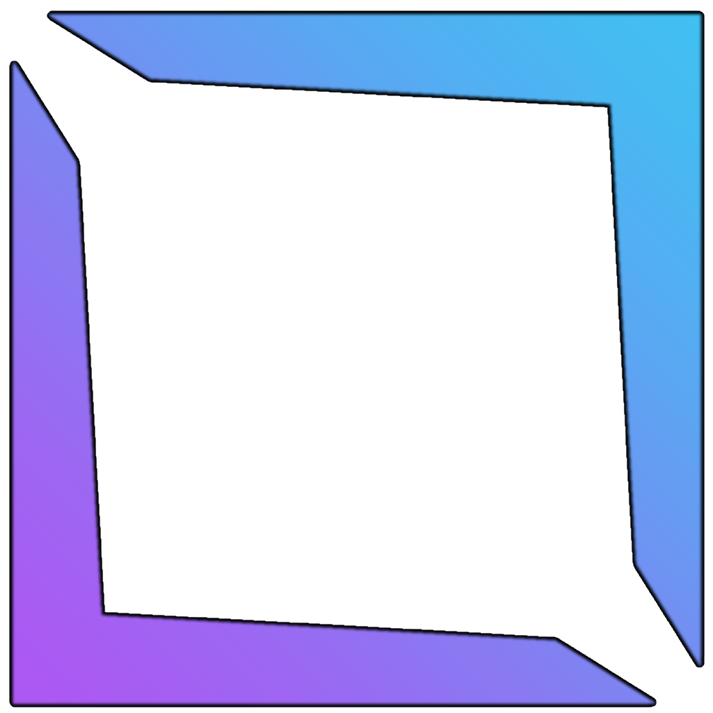

# bloxify

Bloxify is a plugin for replicating roblox bones/attachments onto custom roblox rigs. This is useful for creating a tower defense game because if you want to ad a six pack to your zombies and animate it like a normal roblox character, you would have to add all the motor6ds and attachments into each part. This plugin handles those scenarios.

# Issues

There are many issues you may come across that may require manual editing.

## Parts not centering

If you add any geometry to your character that will increase its original size (such as a 6 pack), It won't center properly and you'll need to edit the motor6ds manually.

## Parts facing the wrong direction

Generally its because you made changes on the opposite side of where the head was facing(head is primary part of rig), you can rotate the parts you messed up in blender and align them to look almost perfect. For future reference you can apply a face texture in blender to the rig.

If nothing has worked, try editing these values during export:

